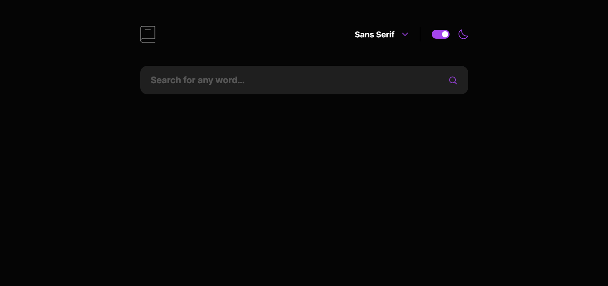

# Frontend Mentor - Dictionary web app solution

This is a solution to the [Dictionary web app challenge on Frontend Mentor](https://www.frontendmentor.io/challenges/dictionary-web-app-h5wwnyuKFL). Frontend Mentor challenges help you improve your coding skills by building realistic projects.

## Table of contents

- [Overview](#overview)
  - [The challenge](#the-challenge)
  - [Screenshot](#screenshot)
  - [Links](#links)
- [My process](#my-process)
  - [Built with](#built-with)
  - [What I learned](#what-i-learned)
  - [Useful resources](#useful-resources)
- [Author](#author)

## Overview

### The challenge

Users should be able to:

- Search for words using the input field
- See the Free Dictionary API's response for the searched word
- See a form validation message when trying to submit a blank form
- Play the audio file for a word when it's available
- Switch between serif, sans serif, and monospace fonts
- Switch between light and dark themes
- View the optimal layout for the interface depending on their device's screen size
- See hover and focus states for all interactive elements on the page
- **Bonus**: Have the correct color scheme chosen for them based on their computer preferences. _Hint_: Research `prefers-color-scheme` in CSS.

### Screenshot



### Links

- Solution URL: [Github Repository](https://github.com/simokitkat/dictionary-web-app)
- Live Site URL: [Frontend Mentor | Dictionary web app](https://freedictionarywebapp.netlify.app/)

## My process

### Built with

- SCSS
- [React](https://reactjs.org/) - JS library
- [nanoid](https://github.com/ai/nanoid) - React Library

### What I learned

I learned about the prefers-color-scheme media query and also about the hyphens property

```css
.main-word {
  word-wrap: break-word;
  hyphens: auto;
}
```

```js
useEffect(() => {
  if (window.matchMedia("(prefers-color-scheme:dark)").matches) {
    setIsDark(true);
  } else {
    setIsDark(false);
  }
}, []);
```

### Useful resources

## Author

- [Frontend Mentor](https://www.frontendmentor.io/profile/simokitkat)
- [Linkedin](https://www.linkedin.com/in/islamsoliman92)
